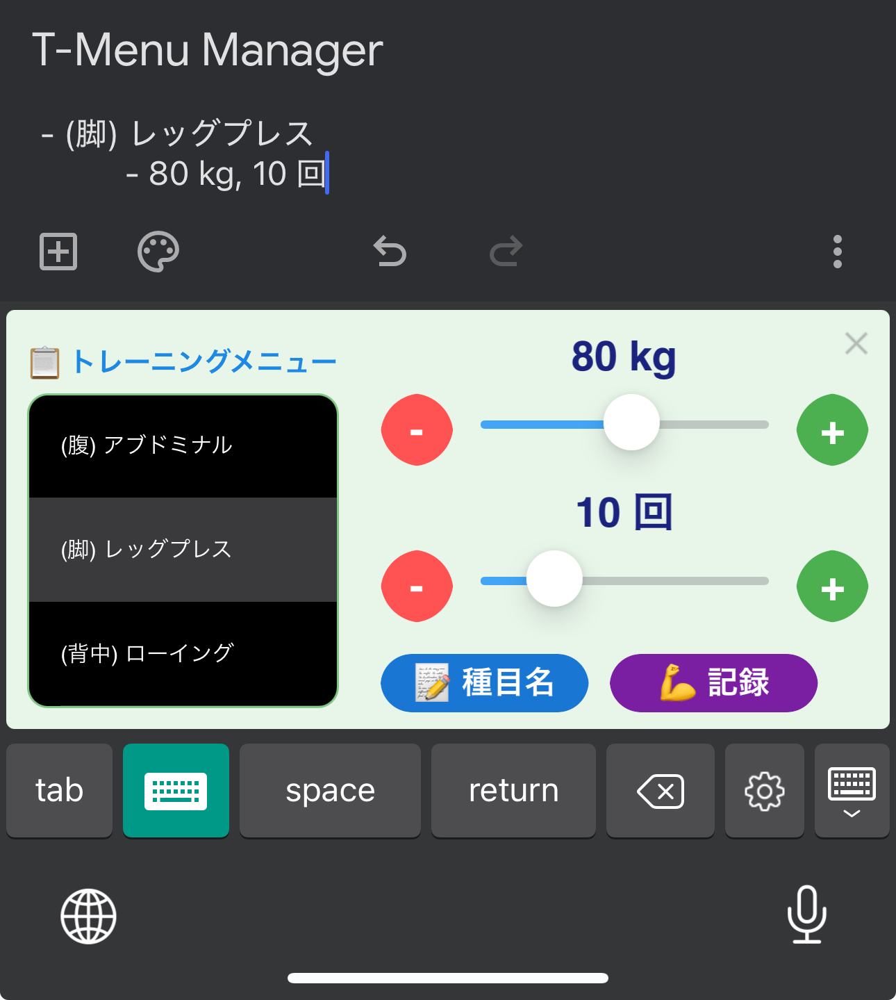
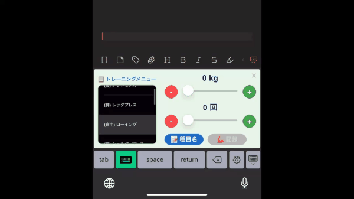
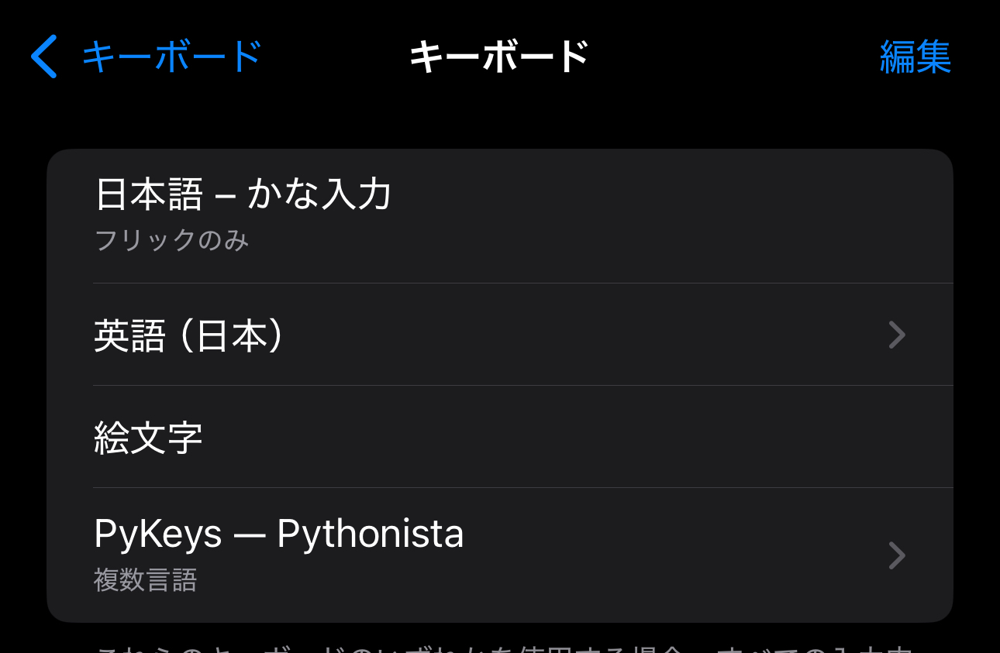
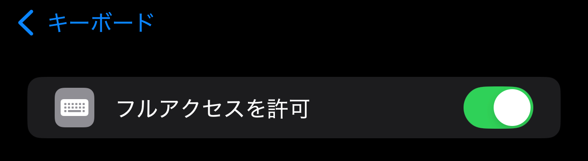
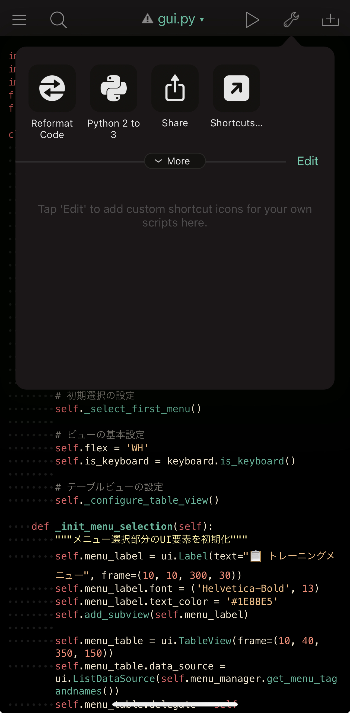
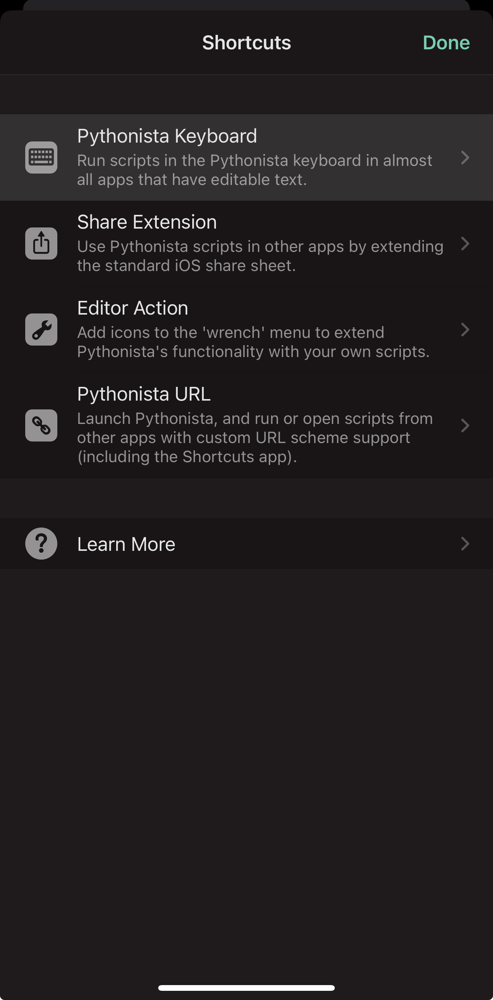
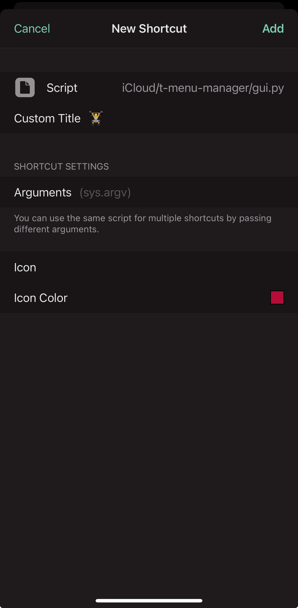

# 🏋️‍♂️ T-Menu Manager

<!--  -->



T-Menu Managerは，[Pythonista3](https://omz-software.com/pythonista/)を用いて**トレーニングメニューを簡単に記録・管理できるカスタムキーボード**です．重量や回数を素早く入力し，履歴を保存できます．

## ✨ 機能

- 📱 キーボード上でのトレーニング記録
- 📋 トレーニングメニューの管理
- 📊 パラメータA（重量など）とパラメータB（回数など）の記録
- 🏆 最高記録の保存と表示
- 💾 履歴データのJSON形式での保存（`history_data.json`）

## 📋 必要条件

- iOS 12以降
- Pythonista 3.4以降
- **Pythonistaキーボード拡張機能**（設定が必要）

## 📱 動作確認済み環境

iPhone 15 Plus (iOS 17) の縦表示で動作確認済みです．その他の環境では表示崩れが発生する可能性があります．

## 📁 ファイル構成

| ファイル名 | 説明 |
|------------|------|
| `gui.py` | メインのGUIアプリケーション |
| `menu_manager.py` | メニュー管理クラス |
| `history.py` | トレーニング履歴管理クラス |
| `menu.txt` | メニュー設定ファイル |
| `history_data.json` | トレーニング履歴データ |

## 🔧 インストール方法

1. すべてのファイル（`gui.py`, `menu_manager.py`, `history.py`, `menu.txt`）を同じフォルダに配置します
   - `history_data.json`は初回実行時に自動的に作成されるため，事前に用意する必要はありません
   - Pythonistaアプリ内の「On My iPad/iPhone」または「iCloud Drive」のどちらのフォルダでも動作します

2. **Pythonistaキーボードの設定**:



   - iOS設定アプリを開く
   - 「一般」→「キーボード」→「キーボード」→「新しいキーボードを追加」
   - 「PyKeys Pythonista」を選択



   - ⚠️ **「PyKeys Pythonista」をタップし，「フルアクセスを許可」をオンにする**（ファイル読み書きに必要）

3. **Pythonistaキーボードにスクリプトを追加**:


   - Pythonistaアプリを開く
   - `gui.py`を開く
   - レンチアイコン（アクション）→「ショートカット...」を選択
   - 「キーボード」タブで「+」をタップし，`gui.py`を追加

## 📝 メニュー設定

`menu.txt`は以下の形式で記述します：

```
メニュー名,ターゲット部位,パラメータA単位,パラメータAステップ,パラメータB単位,パラメータBステップ,パラメータA最大値,パラメータB最大値
```

例：
```
アブドミナル,腹,kg,5,回,1,150,50
ランニング,有酸素,km,0.1,km/h,0.1,50,20
```

## 🚀 使用方法

### ⌨️ キーボードの起動

1. テキスト入力が必要なアプリ（メモ，Obsidianなど）を開く
2. キーボードの地球儀アイコンを長押しし，「Pythonista」を選択
3. Pythonistaキーボードが表示されたら，追加したショートカットをタップ

### 📊 トレーニング記録

1. トレーニングメニューを選択
2. パラメータAとパラメータBを設定
3. 「記録」ボタンを押してトレーニング記録を保存
4. 記録がテキストとして入力されます

#### 入力例

記録ボタンを押すと，以下のような形式でテキストが入力されます：

```
アブドミナル: 50kg x 15回 (2023-06-15 14:30)
ランニング: 5.0km x 10.0km/h (2023-06-15 15:45)
```

日付と時刻は自動的に記録時の値が使用されます．

### ⚙️ パラメータ設定

- スライダーまたは+/-ボタンで値を調整
- **パラメータが0で，かつステップが0でない場合は記録不可**
  - この場合，記録ボタンは灰色に変化し，タップできなくなります
- 🔴 最高記録を超えると表示が**赤色**に変化

### 🔄 キーボード連携

- キーボード表示時は自動的にテーブルビューの表示を最適化
- 種目名と記録をキーボードに直接出力可能

### 🎮 ボタン操作と出力結果

各ボタンを押した時の動作と出力結果は以下の通りです：

#### 「📝 種目名」ボタン

このボタンを押すと，選択中のトレーニングメニュー名がテキストとして入力されます：

```
- アブドミナル
```

#### 「💪 記録」ボタン

このボタンを押すと，現在設定されているパラメータA（重量など）とパラメータB（回数など）の値がテキストとして入力されます：

```
  - 50 kg, 15 回
```

記録ボタンを押した時の動作：
- ⚠️ パラメータが0で，かつステップが0でない場合は記録できません（ボタンが灰色になります）
- 🏆 最高記録を超えた場合は「**新記録達成！おめでとう！**」と表示されます
- 🔥 通常の記録の場合は「**素晴らしい！記録しました！**」と表示されます
- 💾 記録は自動的に`history_data.json`に保存され，次回同じメニューを選択した際に最高記録として表示されます

#### パラメータ調整ボタン

- 「+」ボタン：対応するパラメータの値をステップ分増加させます
- 「-」ボタン：対応するパラメータの値をステップ分減少させます
- スライダー：パラメータの値を連続的に調整できます

パラメータが最高記録を超えると，数値が🔴 **赤色**で表示されます．

## 👨‍💻 開発者向け情報

### 🧩 クラス構成

| クラス名 | 説明 | ファイル |
|----------|------|----------|
| `TrainingApp` | メインのGUIアプリケーションクラス | `gui.py` |
| `MenuManager` | メニュー設定の管理クラス | `menu_manager.py` |
| `TrainingHistory` | トレーニング履歴管理クラス | `history.py` |
| `MenuConfig` | メニュー設定を保持するデータクラス | `menu_manager.py` |
| `ParameterConfig` | パラメータ設定を保持するデータクラス | `menu_manager.py` |
| `TrainingRecord` | トレーニング記録を保持するデータクラス | `history.py` |